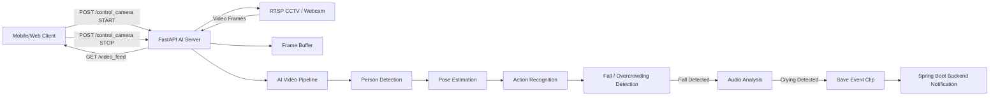

# Infant Safety Monitor

A real-time AI safety monitoring server for detecting infant fall events, overcrowding situations, and crying signals from CCTV or webcam streams.

This repository contains the FastAPI-based AI analysis server for the Infant Safety Monitor project. The system receives a live video stream from an RTSP camera or local webcam, performs real-time computer vision inference, stores event-based video clips, and sends safety alerts to an external Spring Boot backend server.

---

## 1. Project Overview

### Real-time Monitoring Preview

> Place your demo image here.

```markdown

```

Modern infant care environments require immediate response when safety-critical events occur, such as a child falling, crying after impact, or excessive crowding in a monitored area. However, continuous manual monitoring is difficult and error-prone.

Infant Safety Monitor addresses this problem by implementing a real-time AI analysis server that combines video-based fall detection, person-count monitoring, audio-based crying detection, and event-driven notification delivery.

The system is designed around the following pipeline:

1. A mobile or web client sends a monitoring start request to the FastAPI server.
2. The server receives live video from an RTSP CCTV stream or local webcam.
3. Each frame is processed through an AI pipeline for person detection, pose estimation, action recognition, and overcrowding detection.
4. When a fall event is detected, the server triggers audio analysis to determine whether crying is present.
5. If a critical event is confirmed, the server saves a short video clip from the frame buffer and sends an alert to the Spring Boot backend.
6. The processed video stream is exposed to the client through a real-time streaming endpoint.

---

## 2. Key Features

### Real-time Video Stream Analysis

Supports both RTSP camera addresses and local webcam indexes as video input sources. The FastAPI server continuously reads frames through OpenCV and processes them in near real time.

### Fall Detection Pipeline

Uses a multi-stage computer vision pipeline:

* Tiny-YOLO one-class detector for person detection
* AlphaPose/SPPE-based skeleton pose estimation
* ST-GCN-based action recognition
* Fall event classification based on tracked human motion

The original action recognition pipeline supports seven action classes:

* Standing
* Walking
* Sitting
* Lying Down
* Stand Up
* Sit Down
* Fall Down

### Crying Detection after Fall Events

When a fall event is detected, the server performs audio analysis for a short period to determine whether the child is crying. This reduces false-positive alerts by combining visual and audio signals.

### Event-based Video Clip Saving

The server maintains a rolling frame buffer using a `deque` structure. When a safety event occurs, the system saves the frames around the event timing as an `.mp4` video clip.

### Spring Boot Backend Notification

When a critical event is confirmed, the FastAPI server sends event metadata and saved video information to the external Spring Boot backend server through asynchronous HTTP communication.

### Remote Camera Control API

The server exposes HTTP APIs that allow an external client to start and stop monitoring remotely.

### Real-time Processed Video Feed

The processed video stream, including visual annotations such as bounding boxes or detection results, is returned through a `StreamingResponse` endpoint.

---

## 3. System Architecture

### System Architecture Diagram

> Place your architecture image here.

```markdown

```

The system is organized into four main layers.

### Client Layer

The client layer consists of a mobile app or web client that sends monitoring control requests and receives the processed video stream.

Main responsibilities:

* Send monitoring START/STOP requests
* Display real-time processed video
* Receive safety event results through the backend system

### Input Layer

The input layer provides live video data to the AI server.

Supported sources:

* RTSP CCTV stream
* Local webcam index
* Test video source for development and validation

### FastAPI AI Server Layer

The FastAPI server acts as the core control and inference gateway.

Main responsibilities:

* Receive camera control requests
* Manage server state
* Read frames from the video source
* Maintain the frame buffer
* Execute AI inference
* Encode processed frames
* Stream processed video to the client
* Save event video clips
* Send event notifications to the backend server

### AI Analysis Layer

The AI analysis layer performs multi-modal event detection.

Main components:

* `Detection/`: person detection model logic
* `SPPE/`: pose estimation module based on AlphaPose/SPPE
* `Actionsrecognition/`: ST-GCN-based action recognition
* `Track/`: person tracking and motion association
* `audio_inference.py`: crying sound detection
* `yolo_inference.py`: object/person detection and notification logic
* `fall_detection_pipeline.py`: fall detection pipeline integration

### External Backend Layer

The external Spring Boot backend receives safety event notifications from the FastAPI AI server.

Main responsibilities:

* Receive fall and overcrowding event notifications
* Store or forward event metadata
* Provide event results to the user-facing application

---

## 4. System Flow



---

## 5. API Endpoints

| Method | Endpoint          | Request                           | Response                           | Description                                |
| ------ | ----------------- | --------------------------------- | ---------------------------------- | ------------------------------------------ |
| `POST` | `/control_camera` | `cctvAddress`, `userId`, `action` | `StreamingResponse` or JSON        | Starts or stops the video analysis process |
| `GET`  | `/video_feed`     | -                                 | `multipart/x-mixed-replace` stream | Streams the processed video feed           |
| `GET`  | `/status`         | -                                 | JSON                               | Returns current server state               |
| `POST` | `/test_fall`      | -                                 | JSON                               | Tests event video saving logic             |

### Example: Start Monitoring

```json
{
  "cctvAddress": "0",
  "userId": 1,
  "action": "START"
}
```

### Example: Stop Monitoring

```json
{
  "cctvAddress": "0",
  "userId": 1,
  "action": "STOP"
}
```

---

## 6. Repository Layout

```text
infant_safety_monitor/
|-- main.py                         # FastAPI entry point and camera control API
|-- App.py                          # Application-level execution logic
|-- config.py                       # Configuration values
|-- fall_detection_pipeline.py      # Fall detection pipeline integration
|-- yolo_inference.py               # YOLO-based detection and backend notification logic
|-- audio_inference.py              # Crying sound detection logic
|-- video_buffer.py                 # Frame buffer management
|-- store_video.py                  # Event video saving logic
|-- process_video.py                # Video processing utilities
|-- CameraLoader.py                 # Camera/video source loader
|-- DetectorLoader.py               # Detection model loader
|-- PoseEstimateLoader.py           # Pose estimation model loader
|-- ActionsEstLoader.py             # Action recognition model loader
|-- Visualizer.py                   # Visualization utilities
|-- pose_utils.py                   # Pose processing utilities
|-- pPose_nms.py                    # Pose NMS utility
|
|-- Detection/                      # Person detection model implementation
|-- SPPE/                           # AlphaPose/SPPE pose estimation module
|-- Actionsrecognition/             # ST-GCN action recognition module
|-- Track/                          # Person tracking logic
|-- models/                         # Model placeholder directory
|-- templates/                      # Web template files
|
|-- requirements.txt                # Python dependencies
|-- package.json                    # Frontend/tooling dependencies if used
|-- run.bat                         # Windows execution helper
|-- startJSON.py                    # START request test script
|-- stopJSON.py                     # STOP request test script
`-- README.md
```

---

## 7. Prerequisites

### Runtime Environment

* Python 3.9
* PyTorch
* OpenCV
* FastAPI
* Pydantic
* Sounddevice
* Scipy
* Uvicorn

### External System

* Spring Boot backend server for receiving event notifications
* RTSP camera or local webcam
* Pre-trained model weights for detection, pose estimation, and action recognition

---

## 8. Installation

Clone the repository:

```bash
git clone https://github.com/ghpark00/infant_safety_monitor.git
cd infant_safety_monitor
```

Create and activate a virtual environment:

```bash
python -m venv venv
source venv/bin/activate
```

For Windows:

```bash
venv\Scripts\activate
```

Install dependencies:

```bash
pip install -r requirements.txt
```

---

## 9. Model Preparation

This project uses multiple AI models for the video analysis pipeline.

Required model components:

* Tiny-YOLO one-class person detection model
* SPPE / AlphaPose pose estimation model
* ST-GCN action recognition model
* Crying detection model or audio inference assets

Place the model weights under the appropriate `models/` subdirectories.

Example structure:

```text
models/
|-- yolo-tiny-onecls/
|-- sppe/
`-- TSSTG/
```

Large model files such as `.pt`, `.pth`, `.onnx`, `.h5`, and `.ckpt` are excluded from Git tracking.

---

## 10. Running the Server

Start the FastAPI server:

```bash
uvicorn main:app --host 0.0.0.0 --port 8000 --reload
```

Open the API documentation:

```text
http://localhost:8000/docs
```

Open the processed video stream:

```text
http://localhost:8000/video_feed
```

---

## 11. Development and Testing

### API Test

You can test the control API using Swagger UI, Postman, or a Python request script.

Start monitoring:

```bash
python startJSON.py
```

Stop monitoring:

```bash
python stopJSON.py
```

### Event Scenario Test

A representative integration test scenario is:

1. Send a `START` request to `/control_camera`.
2. Confirm that the server opens the webcam or RTSP stream.
3. Confirm that `/video_feed` returns processed video frames.
4. Simulate a fall action in front of the camera.
5. Play or provide a crying sound sample.
6. Confirm that the server saves an event video clip.
7. Confirm that the Spring Boot backend receives the event notification.
8. Send a `STOP` request and confirm that server resources are released.

---

## 12. Implementation Details

### Frame Buffer

The server stores recent frames in memory using a circular buffer. This allows the system to save a short video clip around the moment when an event occurs.

### Cooldown Logic

After a fall event is detected, the server applies an audio-check cooldown interval to prevent repeated crying analysis and excessive duplicate notifications.

### Server Lifecycle Management

Heavy AI models are loaded during the server startup lifecycle to reduce delay on the first inference request. Camera and video resources are safely released when monitoring stops or the server shuts down.

### Asynchronous Notification

Event notifications are sent to the Spring Boot backend using asynchronous HTTP communication to avoid blocking the video processing loop.

---

## 13. Tech Stack

### Backend / API

* FastAPI
* Pydantic
* Uvicorn
* aiohttp / httpx

### Computer Vision

* OpenCV
* PyTorch
* Tiny-YOLO
* AlphaPose / SPPE
* ST-GCN

### Audio Processing

* Sounddevice
* Scipy

### Integration

* Spring Boot backend API
* RESTful HTTP communication
* Multipart video streaming

---

## 14. Portfolio Focus

This project demonstrates the implementation of a real-time AI server that integrates video analysis, audio analysis, event buffering, and backend notification into a single safety monitoring pipeline.

Key engineering points:

* Designed and implemented FastAPI-based AI inference server
* Integrated real-time video streaming with OpenCV
* Connected fall detection, pose estimation, and action recognition modules
* Implemented event-triggered crying detection
* Built frame-buffer-based event clip saving
* Implemented REST API control for monitoring START/STOP
* Integrated asynchronous notification with Spring Boot backend
* Validated the system through API tests and end-to-end event scenarios

---

## 15. Contributor

Kyonggi University Basic Capstone Design Project

* Kwanho Park — FastAPI AI server development, AI model integration, event detection pipeline, API testing, and backend notification integration
