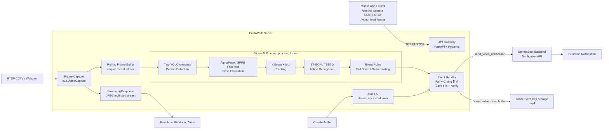

# Infant Safety Monitoring System Architecture - Mermaid Source

```mermaid
flowchart LR
    Client[Mobile App / Client
/control_camera START·STOP
/video_feed·/status]
    Camera[RTSP CCTV / Webcam]
    Audio[On-site Audio]

    subgraph FastAPI[FastAPI AI Server]
        API[API Gateway
FastAPI + Pydantic]
        Capture[Frame Capture
cv2.VideoCapture]
        Buffer[Rolling Frame Buffer
deque: recent ~3 sec]
        Stream[StreamingResponse
JPEG multipart stream]
        subgraph VideoAI[Video AI Pipeline: process_frame]
            YOLO[Tiny-YOLO oneclass
Person Detection]
            SPPE[AlphaPose / SPPE FastPose
Pose Estimation]
            Track[Kalman + IoU
Tracking]
            STGCN[ST-GCN / TSSTG
Action Recognition]
            Rules[Event Rules
Fall Down / Overcrowding]
        end
        Cry[Audio AI
detect_cry + cooldown]
        Event[Event Handler
Fall + Crying 판단
Save clip + Notify]
    end

    Spring[Spring Boot Backend
Notification API]
    Storage[Local Event Clip Storage
.mp4]
    Viewer[Real-time Monitoring View]
    Notify[Guardian Notification]

    Client -->|START/STOP| API
    Camera --> Capture
    Capture --> Buffer
    Buffer --> YOLO --> SPPE --> Track --> STGCN --> Rules --> Event
    Capture --> Stream --> Viewer
    Audio --> Cry --> Event
    Event -->|send_video_notification| Spring --> Notify
    Event -->|save_video_from_buffer| Storage
```
